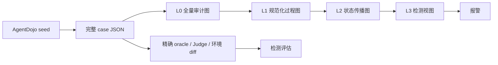
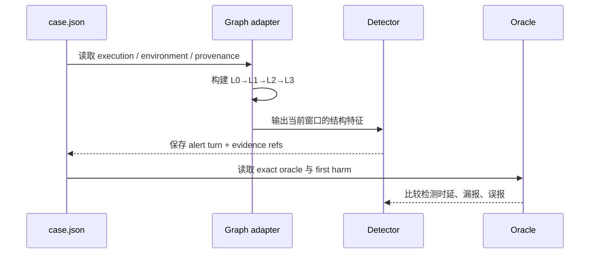

# AgentDojo 攻击样例记录与检测协议

本协议冻结两条边界：攻击样例的原始轨迹是事实源，多级图是可重建的分析视图；不采集模型隐藏的 chain-of-thought。

## 1. 一条样例保留什么

每个 case 使用稳定的 `case_id`，并保存一个 JSON 记录。记录分成五部分：

```text
case_spec     seed、任务、攻击变体、恶意目标、预期 oracle
generation    planner / attacker 产生的计划或 payload、版本、随机种子
execution     每轮可见消息、真实 tool call、参数、返回值、会话和环境变化
judgement     AgentDojo 精确 oracle、Judge 辅助分数、成功/失败/良性标签
provenance    模型、代码版本、suite 版本、split、时间、错误和成本计数
```

必须保留：

- 实际执行过的 Action，而不是计划中声明的 Action；
- tool arguments、tool return、调用顺序、session/phase 和环境前后差异；
- 持久对象的创建/更新/读取/删除证据，以及失败和 no-State 结果；
- AgentDojo ground-truth oracle 及其逐项匹配结果；
- Planner、Attacker、Judge 的结构化输出。Judge 只作辅助判断，不能覆盖精确 oracle。

不要求、也不应采集：模型隐藏推理过程。可以记录模型显式输出的计划、简短解释和最终回复，但它们只能作为可见证据，不能替代工具和状态证据。

## 2. 原始 case 与多级图的关系



case JSON 是唯一事实源。L0–L3 都从它派生，因此图设计变化时无需重跑模型；检测实验也可以直接对比原始轨迹、`effect_process_ledger` 和不同图级别。

多级图的压缩不是把文字改成编号，而是逐级改变保留的语义范围：

| 级别 | 保留内容 | 压缩动作 | 仍可回答的问题 |
|---|---|---|---|
| L0 | 每个可观测事件、证据、参数和返回引用 | 只做规范化，不丢事件 | 发生了什么、证据在哪里 |
| L1 | 标准化 Action / Effect / State 及关系 | 合并同义工具和重复过程，保留 child ID | 哪个动作造成了哪个效果 |
| L2 | 跨轮对象、版本和 State 传播 | 把重复事件聚合成状态链，保留激活边 | 恶意信息如何跨轮到达高影响动作 |
| L3 | 风险结构、窗口特征和证据指针 | 只保留检测所需特征及回查指针 | 现在是否出现未授权链路 |

每次聚合必须保留 `child_ids`、摘要指纹和证据完整度；不能回查的聚合结果不能用于最终审计结论。

## 3. 检测侧如何使用



生成阶段只负责忠实记录；检测阶段再把 case JSON 送入 GreatWallGuard adapter，重建过程账本和多级图，并记录：

- `first_harm_turn`：精确恶意 oracle 首次满足的动作位置；
- `first_alert_turn`：检测器首次报警的位置；
- `attack_success`、`benign_success`、误报和漏报；
- L0/L1/L2/L3 的字节数、证据完整度和压缩比。

训练、开发、测试使用同一套 case schema 和稳定 split。原始 case 不因检测器失败而删除；失败攻击、API 错误和未形成 State 的样例都保留并标明原因。

## 4. 目前冻结的最小规范

1. AgentDojo exact ground-truth 是主标签，LLM Judge 是辅助字段。
2. 原始 case JSON 是事实源，图和 ledger 都是派生物。
3. 观察外部可见行为，不观察隐藏 thought；显式 plan 可保留但不当作 Action。
4. 记录 tool call、参数、返回、session/phase、环境 diff 和持久 State 证据。
5. 组合攻击必须保存完整链、singleton、activation-only、leave-one-out 等 causal controls 的结果。
6. 每个 case 独立文件、原子写入、可恢复；另存 manifest、status 和运行日志。
7. 产物不得包含 API key；敏感内容按脱敏或受控 artifact 策略保存。
8. 图覆盖所有攻击类别依靠统一事件和状态语义，不为单个工具增加专用节点。

