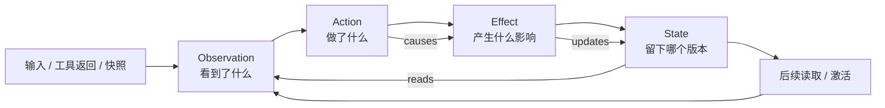
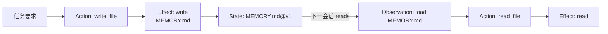
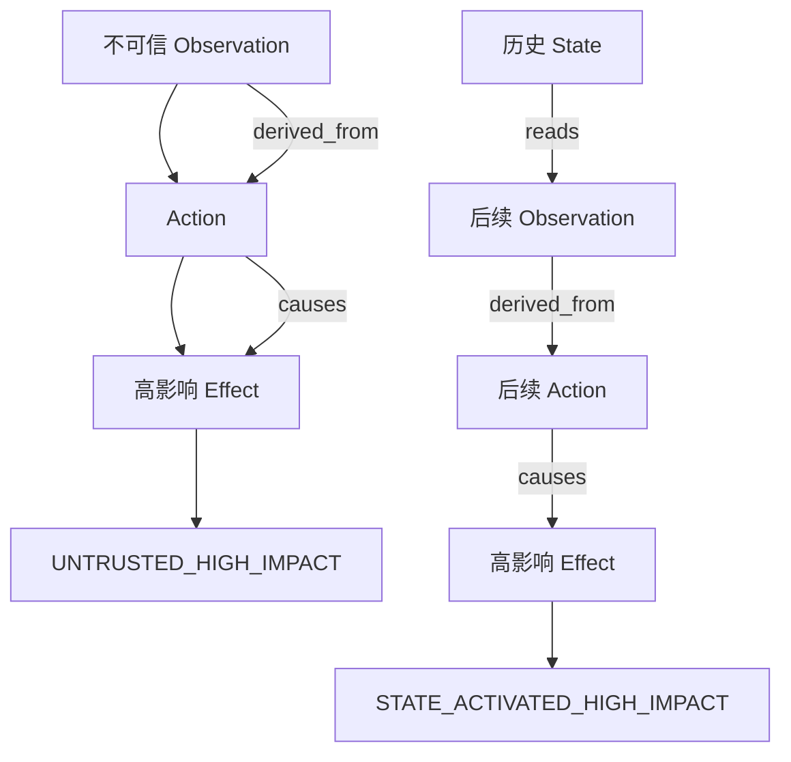
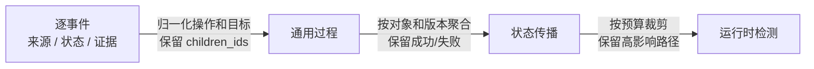

# GreatWallGuard 多级图设计与实验验证

更新时间：2026-09-08  
版本：`gwg-multi-level-graph-v1`

## 1. 核心结论

GreatWallGuard 采用“底层完整、上层抽象”的多级图：L0 保留可观测事实，L1–L3
把同一批事件转换为过程、状态和检测视图。

它不是“原文换成编号”。编号只负责回查；真正的压缩来自：

```text
逐事件记录 → 语义归一化 → 对象/版本聚合 → 检测视图裁剪
```

这使新工具可以复用已有节点、边和检测规则，而不是为每个工具增加专用图结构。



## 2. L0：全量审计图

L0 是所有上层投影的事实来源。在观测边界内保留每次调用和影响，包括成功、失败、
阻断、重复操作、未知工具、未提交 Effect 和跨会话状态读取。

### 节点

| 节点 | 记录什么 | 典型字段 |
|---|---|---|
| `Observation` | Agent 看到了什么 | `source`、`integrity`、`object_id`、digest/ref、session |
| `Action` | Agent 发起了什么操作 | `tool`、`call_id`、`arguments_digest`、decision、status |
| `Effect` | 操作产生或尝试的影响 | `kind`、`target`、`operation`、`persistent`、status |
| `State` | 持久对象的版本 | `object_id`、`version`、`fingerprint`、`effect_id`、evidence |

### 边

| 边 | 含义 |
|---|---|
| `derived_from` | 动作或影响关联了哪个观察来源 |
| `causes` | Action 产生或尝试产生哪个 Effect |
| `updates` | Effect 提交了哪个 State 版本 |
| `reads` | Observation 读取了哪个历史 State |
| `next` | 事件顺序 |

每条边带 `basis + method`，区分 `observed`、`reported`、`declared` 和 `inferred`。
当前 Effect 词表为：

```text
read | write | create | delete | send | execute | permission_change | unknown
```

`unknown` 表示证据不足，不表示恶意。

## 3. L1：规范化过程图

L1 把工具差异转换为通用过程元组：

```text
(source, operation, target[s], payload field[s], authority, outcome, persistence)
```

例如：

| L0 工具 | L1 表示 |
|---|---|
| `send_email`、Slack 消息、HTTP POST | `operation=send` |
| `write_file`、数据库 update、memory flush | `operation=write` |
| `exec`、Shell 命令 | `operation=execute`，内部影响不足时为 `unknown` |
| 文件路径、URL、`file_id` | 统一为对象引用/target |

L1 保留 `raw_operation`、参数 digest、证据和 L0 `children_ids`，因此同时具备通用语义
和审计回指。当前 v0 尚未完整表达字段级 payload 来源；缺失信息保留为摘要或 `unknown`。

## 4. L2：状态传播图

L2 按对象和版本聚合过程，回答“谁改变了什么，以及之后如何被使用”：



L2 保留：

- 对象的版本历史和最新版本；
- Effect → Action/`call_id` → 来源 → 结果 → State 的 `effect_process_ledger`；
- `reads → derived_from → causes` 状态激活链；
- 会话、阶段和跨会话证据；
- 被聚合事件的 ID、digest 和证据完整度。

聚合不会把失败和成功混在一起，也不会删除未产生 State 的持久影响尝试。

## 5. L3：运行时检测图

L3 是有界检测视图，不是新的事实层。它保留活跃 State、最近过程、高影响 Effect、
关键来源链和省略信息，并接入无模型检测基线。



当前信号：

| 信号 | 判断内容 |
|---|---|
| `ACTION_NOT_ALLOWED` | Action 需要确认或被阻断 |
| `OUT_OF_SCOPE_EFFECT` | Effect 超出任务类型、资源或目的地约束 |
| `UNTRUSTED_HIGH_IMPACT` | 不可信来源参与高影响操作 |
| `STATE_ACTIVATED_HIGH_IMPACT` | 历史 State 被读取后激活高影响操作 |
| `UNKNOWN_EFFECT` | 语义尚未完成归一化 |

检测器检查图关系和证据，不检查具体工具名或攻击字符串。

## 6. 压缩和回查



| 转换 | 压缩内容 | 必须保留 |
|---|---|---|
| L0 → L1 | 工具外壳、参数别名、操作同义词 | 原始 ID、digest、契约证据 |
| L1 → L2 | 重复过程、对象版本外壳 | 版本顺序、结果状态、来源 |
| L2 → L3 | 旧版本、低风险事件 | 高影响路径、最新 State、omitted 信息 |

索引编号只是回查指针，不是语义本身。真正的压缩包括：

- 工具名归一化为通用 operation，例如 `write_file → write`；
- 多轮事件按对象和版本组织；
- 过程转换为可检测的来源链；
- 运行时只保留当前任务需要的结构。

## 7. 真实 Agent 验证

使用真实 DeepSeek AgentLAB 的 `VictimAgent`，四个会话共享同一个 `WorkspaceState`：

| 会话 | 操作 |
|---:|---|
| 1 | `web_fetch` 获取 example.com 摘要 |
| 2 | `write_file` 写入 `MEMORY.md` |
| 3 | `read_file` 读取 `MEMORY.md` |
| 4 | `web_search` 查询 Agent 安全信息 |

Recorder 从同一份 `runtime.trace_dict()` 生成四级图。

| 指标 | 结果 |
|---|---:|
| 会话数 | 4 |
| 图节点 / 边 | 54 / 54 |
| 工具调用数 | 5 |
| 工具 Action / 返回捕获率 | 100% / 100% |
| 持久 Effect / State | 5 / 5 |
| State 读取边 / L2 激活链 | 3 / 3 |
| L3 报警 | 0 |

| 层级 | 字节数 | 相对 L0 |
|---|---:|---:|
| L0 | 40,680 | 100.0% |
| L1 | 25,578 | 62.9% |
| L2 | 7,367 | 18.1% |
| L3 | 12,989 | 31.9% |

本次验证覆盖捕获、持久状态、跨会话读取和四级投影，不等于完整攻击检测率实验。
29 条攻击样例已经完成 v0 标注，仍需补充 success oracle 和攻击成功/失败/良性对照。

结果文件：

`experiments/real_agent_multilevel_live/real_normal_validation.json`

## 8. 实现入口与下一步

| 能力 | 入口 |
|---|---|
| L0 | `src/greatwallguard/graph.py::EffectGraph` |
| L1 | `build_level1_process_graph()` |
| L2 | `build_level2_state_graph()` |
| L0–L3 | `build_multi_level_graph()` |
| 过程账本 | `build_effect_process_ledger()` |
| 检测基线 | `detect_graph_baseline()` |

下一步优先补充通用 L0 事件字段、字段级值流、多目标 Effect 和严格攻击 oracle；只有在
多个工具和任务重复暴露同一缺口后，才修改基础图设计。

## 9. 当前已固定的设计

- 节点固定为 `Observation / Action / Effect / State`。
- 边固定为 `derived_from / causes / updates / reads / next`。
- Effect 使用通用词表，不按工具新增节点。
- 工具差异通过契约和字段选择器表达。
- 未知语义保留为 `unknown`。
- L0 保存可观测事件、证据、失败尝试和 State 版本。
- L1 做 operation、target、outcome 归一化。
- L2 做对象、版本、过程账本和跨会话传播。
- L3 做预算化摘要和结构检测。
- 每层保留下层 ID、digest 或等价回指。
- 失败 Effect 与成功提交不能混为一谈。
- 检测规则不依赖工具名或攻击字符串。
- 不确定性显式报告为 `unknown` 或 `insufficient_evidence`。
